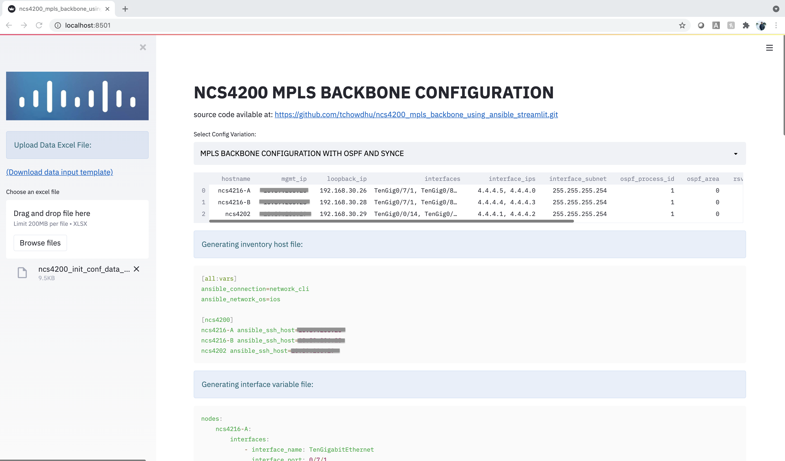
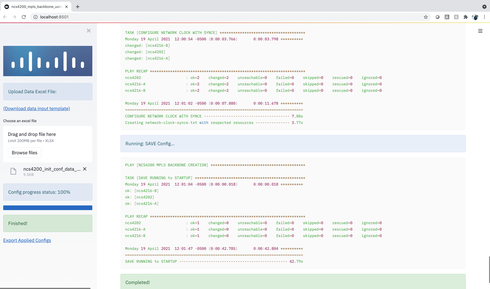

# ncs4200_mpls_backbone_using_ansible_streamlit

*automating mpls backbone creation for CEM services on NCS4200 platform*

---

## Motivation

This projects gives an example of automating configuration of all required mpls backbone settings for cisco NCS4200 platform, to put it upto a point where it is ready for provisioning MPLS/FLEX-LSP tunnels and CEM services. 

## Technologies & Frameworks Used

**Cisco Products & Services:**

- NCS4200
- TDM2IP

**The project has been developed with the combination of**

- ANSIBLE 
- shell script 
- python script.

#### The ANSIBLE portion provides all the required playbooks for configuration task. These include playbooks for:

1. discovery protocol: CDP/ LLDP
2. IP Address: Interface and Loopback
3. IGP: OSPF/ ISIS
4. MPLS TE
5. MPLS LDP
6. RSVP
7. Network-clock synchronization: SyncE/ PTP

#### The shell script provides:

1. Starting point for playing the playbooks.
2. Additional ansible variables, required while playing playbooks.

#### The python script provides:

1. The main starting point for the project. 
2. Streamlit framework for running the project through webGUI
3. Shell script that call ansible playbooks, is run through this python script using various options selected from the webGUI app.

## Features

1. The project is basically a combination of 4 different mpls backbone environments. 

    - MPLS backbone creation with OSPF and SyncE
    - MPLS backbone creation with OSPF and PTP
    - MPLS backbone creation with ISIS and SyncE
    - MPLS backbone creation with ISIS and PTP

 All the other configuration task stated at the ANSIBLE portion above remains same.

2. For each different enviroment, the input parameters ie. ip address, mask, interface name, igp id, loopback id, etc. should be provided from an Excel (.xlsx) file.

3. Excel templates for 4 enviroments can be downloaded prior to configuring the NCS4200 devices.

4. On choosing the right environment and uploading the right excel with data, it creates all required hosts inventory file and host variable files (.yml) which are necessary for running the ansbile playbooks.

5. Then, there are options available to choose specific task (ie. ansible playbook) for configuring NCS4200 devices. The configurations are written in jinja2 template format using NCS4200 IOS-XE CLI syntax. Real configurations (CLI) which are pushed to the NCS4200 devices are created using these templates based on the host variable (.yml) files. 

6. On successful run of all the selected tasks (when and only when the progress status is 100%), there will be an option to export all configurations that were pushed to NCS4200s. This will be a zip file containing seperate .txt files for each configuration playbook and each host (NCS4200) device.

7. On choosing wrong environment selection that is not compatible with the provided excel file, the project shows error and points out what should be the correct columns of the excel file for that particular option.

**N.B.: This is a straightforward standalone WebGUI app for configuring NCS4200 box. It does not keep device configurions in any database.**

## Pre-requisites:

1. NCS4200 devices should have basic initial configs like management IP address, a common super credential (priviledge 15) for development works.
2. ssh enabled
3. Make sure, the devices are accessible in the network from your development enviroment.

## Installation

(**Optional: Follow the steps from any of the links below based on your OS to prepare your development enviroment.**

    - https://developer.cisco.com/learning/lab/containers-dev-win/step/1
    - https://developer.cisco.com/learning/lab/containers-dev-mac/step/1
    - https://developer.cisco.com/learning/lab/containers-dev-ubuntu/step/1

This project has been tested on mac and ubuntu)

1. Open terminal
2. Clone the repository 
3. Go to the project directory
4. Assuming you have proper development enviroment, from terminal run "pip install -r requirements.txt".

## Usage

#### One time steps:

1. Open terminal.
2. Go to the project directory.

3. open .env file and give proper values for the enviroment variables below:
    
    - ***export PYTHONENV=<~python3-environment-path>***
    - ***export NCSUSER=<ncs4200_super_username>***
    - ***export NCSPASS=<ncs4200_supoer_password>***

    
4. run "source .env"

5. run "streamlit run ncs4200_mpls_backbone_using_ansible_streamlit.py"

6. Open browser and goto "http://localhost:8501". In a remote server enviroment this can be changed based on ip address and port number. 
    http://server-ip-address:port

#### Configuration steps (continous):

7. Select Config variation from the 4 different environment options

8. Upload appropriate data excel file.

This step generates inventory and host variable files (.yml)

9. Select tasks from selection box

10. Apply config

11. If error occurs check your environment and/or data input. 
Follow these steps (7-11) for configuring various networks as required.

## Authors & Maintainers

Smart people responsible for the creation and maintenance of this project:

- Tahsin Chowdhury <tchowdhu@cisco.com>

## Credits

1. https://streamlit.io/
2. https://www.youtube.com/watch?v=_9WiB2PDO7k
3. https://developer.cisco.com/automation-ansible/
4. https://blogs.cisco.com/developer/automating-network-operations-3?dtid=osscdc000283

## License

This project is licensed to you under the terms of the [Cisco Sample
Code License](./LICENSE).
